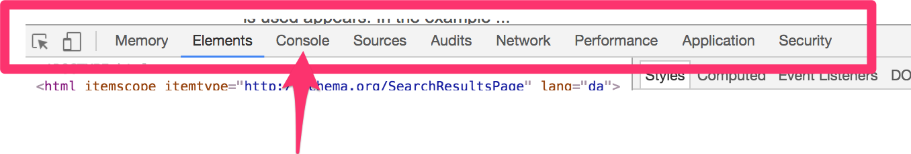

# Sjov med Browseren

# Introduktion
Vi vil i det følgende prøve at lave lidt sjov udelukkende ved brug at en browser og dens værktøjer. 
Der tages her udgangspunkt i Google Chrome, som du skal have installeret på din maskine. Hvis du ikke har det, kan du se mere i kapitlet Værktøjer. 

# Udviklerværktøjerne
Find og åben browserens “Udviklerværktøjer” via menuen. 
Find ud af hvad genvejstasten er på din maskine, så du hurtigt kan åbne dem.

*Start af Chrome udvikler værktøjer*

### Placering
Når værktøjerne er startet, kan placeringen vælges ved hjælp af menuen i højre side:

*Start af Chrome udvikler værktøjer*

Værktøjerne kan placeres “afkoblet”, til-venstre, nederst eller til-højre. Alt efter din skærm størrelse kan det være rart med forskellige placeringer. Størrelsen af værktøjernes forskellige vinduer kan lige ledes ændres ved at trække i dem med musen.

### Menuen
Værktøjerne har øverst oppe en menu med forskellige muligheder.

*Menuen i Udviklerværktøjerne*

Vi vil her beskrive 3 af menupunkterne, som vi vil vende tilbage til.

### Elements

*Menupunktet “Elements”*

Når du i menuen vælger punktet “Elements” bliver du præsenteret for et vindue der er delt i to. Her kan du se web sidens HTML i venstre side og egenskaberne for det valgte HTML element til højre. Højresiden ændre sig i takt med at du vælger elementer til venstre (Prøv at markere noget forskelligt til venstre).

Højresiden kan eksempelvis vise “Styles”, altså udseende for siden.

*Opdelingen i HTML og Egenskaber under Elements*

### Console

*Menupunktet “Console”*

Når du vælger “console”, kommer der et vindue med en konsol/kommandolinje til syne. 
Konsollen tjener to vigtige formål:

* Her vil du senere blive i stand til at udskrive forskellige beskeder, så du ved hvad din kode laver.
* Her kan du skrive kommandoer og få udført din program kode. Prøv eksempelvis at skrive “5+5” og tryk Enter. Hvad sker der?

*Kommandolinjen i Chrome*

### Inspect Element
Yderst til venstre i menu-linjen er der et ekstremt brugbart værktøj. Det hedder “Inspect
Element” og lader dig udpege elementer direkte på en webside.

*Menupunktet “Inspect Element”*

Når du trykker på ikonet bliver det blåt og er aktivt. Du kan herefter holde musen hen over forskellige dele på den aktive webside og den vil vise indholdet.

*Brug af “Inspect” på Google*

Vælger du at trykke på web sidens markering (mens Inspect værktøjet er aktivt) vises HTML elementet i menupunktet “Elements”.

*HTML element findes ved hjælp af Inspect værktøjet*
