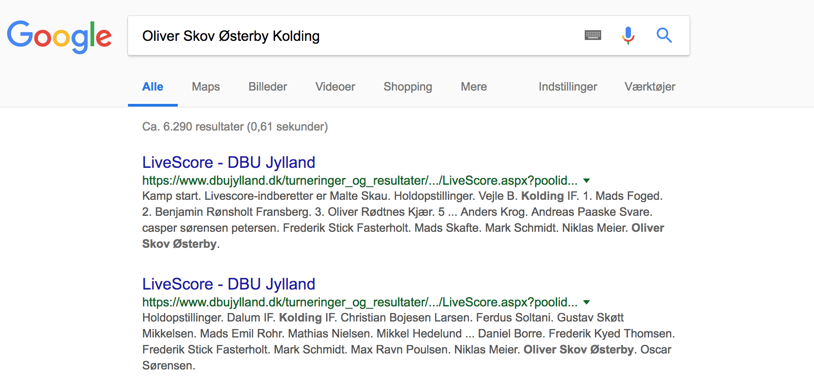
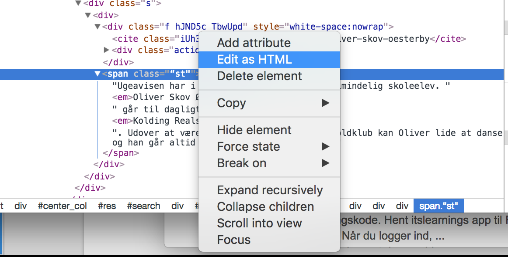

# Prank 1: Google Søgning

## Introduktion
Vi vil i det følgende prøve at benytte Chromes Udviklerværktøjer til at lave nogle sjove pranks med.
Pas på med at afslører dine evner overfor alt for mange på engang, det gør det sværere at lave pranks på andre. 

## De lyserøde underbukser
Vi vil i det følgende prøve at lave et falsk søgeresultat på Google.
Gå ind på google.dk og søg på en kammerats navn og byen, fx.  “Børge Jensen Brøndby. Der vil komme forskellige resultater frem.


*Faktiske søge-resultater*

Du benytter nu det tidligere omtalte inspect værktøj til at finde det øverste søgeresultat.


*“Inspect” værktøjet benyttes til at udpege det ønskede element*

Det du har markeret nu er et såkaldt HTML anchor element (`<a>…</a>`). Det bruges til at
lave links med.
Anchor elementet har en masse attributter (dem med nøgle=“værdi”) - dem vender vi
tilbage til om lidt. Lige nu koncentrere vi os om selve link teksten, som står mellem start
og slut elementet. I dette tilfælde

    <a … >LiveScore - DBU Jylland</a>

Højre-klik på teksten i “Elements” vinduet. Her får du muligheden for at ændre teksten.


*Select "Edit Text" in the menu*

Du skal nu ændre teksten til noget a la:
>Kolding | Nyheder fra Kolding | ugeavisen.dk


*Teksten på elementet ændres*

Resultatet er at overskriften på det første søgeresultat ændres, som vist på nedenstående billede.


*Den nye overskrift på søgeresultatet*

På samme måde findes og ændres den grønne søgetekst til:

>ugeavisen.dk/kolding/oliver-skov-oesterby


*Søgeresultat med link tekst ændret*

Tilslut skal vi blot have ændret den beskrivende tekst. Dette er lidt anderledes, da der er tale om elementer med børn. Find elementet på samme måde og vælg “Edit as HTML”



*Sidste element skal editeres som HTML*

 Der skal nu indsættes en beskrivende tekst af en længde svarende til den Google normalt anvender. Husk at `<em>…</em>` elementet benyttes til at fremhæve tekst med.
Du kan indsætte noget i retning af: 

```HTML
<span class=“st">Ugeavisen har i denne uge besøgt en helt almindelig skoleelev. 
<em>[INDSÆT NAVN]</em> går til dagligt i 5.C  på <em>[INDSÆT SKOLE]</em>. 
Udover at være målmand i den lokale fodboldklub kan Oliver lide at danse og han går 
altid med lyserøde underbukser. </span>
````

Dermed bliver det endelige resultat en Google søgning a la nedenstående. Husk at lukke udviklerværktøjerne.


*Den endelige Google søge resultat side*

Tilbage er blot at spørge Oliver hvad pokker det er for noget med at danse? Når han vil trykke på linket skal du blot sige, at det må han lige gøre på sin egen maskine, da du lige skal på toilet, hvor efter du trykker Windows-Tast + L (lock). Og går din vej …