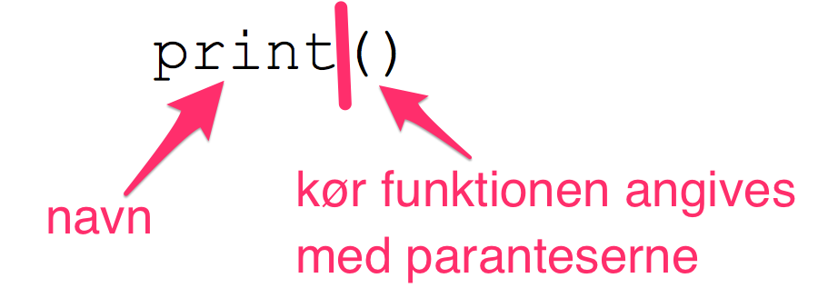
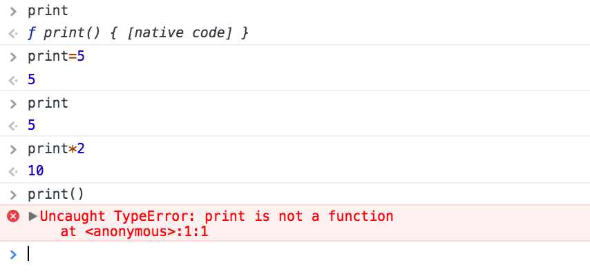

# Prank 1: Kontakt Skolen

## Introduktion
I denne prank vil vi lade som om, at skolen har valgt din kammerat som kontakt person.

## Besøg din skoles hjemmeside 
Da det er din skoles hjemmeside vi vil prøve at ændre på, skal du starte med at finde den i din browser. Hvis du ikke kender adressen kan du tage Google til hjælp.

## Dialog Bokse
Dernæst skal vi have fundet kommandolinjen (Console) frem i udviklerværktøjerne. Kan du huske, hvordan vi gjorde det?

Du har allerede tidligere prøvet at udregne et simpelt regnestykke i kommandolinjen. Men du kan gøre meget mere end det. Konsolen kan fortolke og afvikle programmeringssproget JavaScript. Prøv fx at skrive:

```javascript
alert("Hej med dig!")
```

Og tryk Enter

Smart ikke? Det kan vi bruge, når vi skal ændre skolens kontakt person. Vi kunne f.eks. skrive

```javascript
alert("Venligst kontakt vores duks fra 5.C, som har nummer 33 33 33 33")
```

Eller find på noget andet der kan stå.

Men det er ikke helt så sjovt, hvis vi skal side og skrive kommandoen, så kan vedkommende vi vil lave en prank med jo se det. Derfor skal vi se på, hvordan vi får skolens hjemmeside til at aktivere vores kode.

## Funktioner
Før vi kan få skolens hjemmeside til at vise vores dialog skal vi lige lære noget nyttigt. Vi skal lærer at bruge og gemme funktioner, så vi nemt kan få "noget andet" til at åbne vores dialogboks.

Det er heldigvis ikke så svært.

Vi har allerede kaldt vores første funktion - nemlig _alert_ og den tog som input den tekst vi ville vise i dialogen.

Lad os kalde et par andre simple funktioner (prøv evt. om du kan gætte, hvad de gør, før du kalder dem):

```javascript
print()
```

eller hvad med

```javascript
clear()
```

Disse to funktioner tager ikke noget input. Men her er en anden funktion, der tager noget input:

```javascript
copy("Nej, det var smart!")
```

Har du kørt den? Og der skete ingenting? Prøv så at trykke *Ctrl+V* i konsollen eller i dit yndlings tekstbehandlingsprogram. Kan du se at teksten bliver indsat? Smart ikke?

Lad os lige tage et sidste eksempel, som vi vil bruge om lidt:

```javascript
console.log("Herligt...")
```

Kan du se at denne funktion skriver (logger) tekst til konsollen (deraf navnet _console.log_).

Men vi vil faktisk gerne kunne lave vores egen funktion! Hvordan gør vi det?

Det er heldigvis ikke så svært, men før vi når til at lave en funktion skal vi lige forstå, hvordan vi kan navngive ting, så konsollen kan huske dem. Hvordan kan det f.eks. være at vi kan kalde *print()*? Det er fordi navet *print* er blevet sat lig med en funktion, som vi så kan kalde:


*print funktionen når man kalder den*

Altså, _print_ er navnet på en dims og når vi sætter paranteser bagefter kalder vi dimsen som en funktion.

For at forstå dette bedre kan vi prøve at skrive *print* i konsollen - uden paranteserne: 

```javascript
print
```

Når du kører dette, vil du få at vide at det er en funktion. Selvom det ikke giver så meget mening, kan du nu prøve at sætte _print_ lig med 5:

```javascript
print = 5
```

Prøv at skrive print igen:

```javascript
print
```

Nu får du ikke længere at vide at det er funktion. Nu er _print_ blot 5. Du kan endda gange _print_ med 2:

```javascript
print*2
```

Da _print_ nu er et tal, får du en fejl, hvis du forsøger at kalde den som funktion:

```javascript
print()
```

_print_ er ikke længere en funktion.



*Resultat af ovenstående øvelser med at omdefinere _print_*

Måske har du prøvet noget lignende i matematik, hvor du har fået opgaven:

> Hvad er 2A + 3B hvis A er 5 og B er 2?

Det finder du let ud af, når vi har lært at definere variable:

```javascript
A=5
B=2
2*A+3*B
```
Prøv at kør det i konsollen.

Nå, nu er det jo ikke en matematik time, så tilbage til funktionerne.


## Events
Events er engelsk og kan her bedst oversættes med handling. Vi vil se på hvordan vi kan ændre de handlinger der sker på hjemmesiden.

